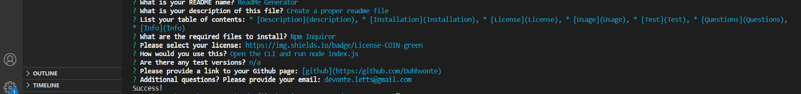
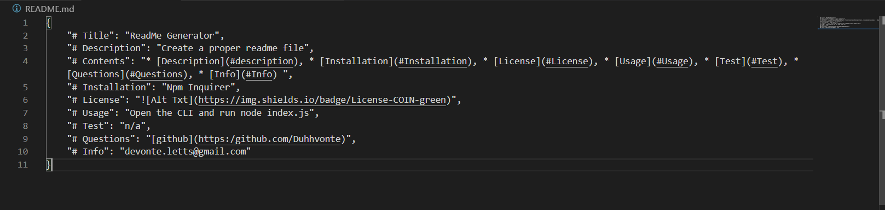

# Title: ReadMe Generator

# Description: 
Create a proper readme file

# Contents: 
* [Description](description
* [Installation](Installation)
* [License](License)
* [Usage](Usage)
* [Test](Test)
* [Questions](Questions)
* [Info](Info)

# Installation: 
Npm Inquirer

# License:

# Usage: 
Open the CLI and run 'node index.js'

# Test: 
n/a

# Questions: 
[github](https:/github.com/Duhhvonte)

# Info: 
devonte.letts@gmail.com
